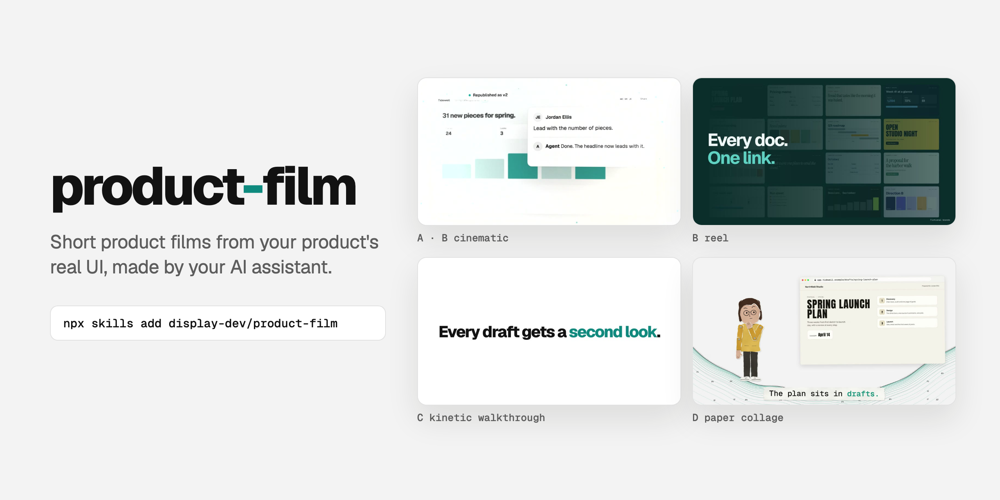

<p></p>

# product-film

**Short product films from your product's real UI — without screen recordings, stock motion templates or AI-video slop.**

Ask an agent for a launch film today and you get one of three things: a screen recording with a zoom on every click, a motion-graphics template that could be any product, or a generated video in which the UI melts. product-film gives the agent a fourth way. It rebuilds your product's screens from your own components, animates them on a deterministic HTML timeline, renders every frame with Playwright and cuts the film with ffmpeg. The UI stays sharp at 3× zoom, every frame can be re-rendered exactly, and a note like "hold the comment longer" changes one number, not the whole film.

## Install

```sh
npx skills add display-dev/product-film --skill product-film
```

Works across Claude Code, Cursor, Codex, OpenCode, Hermes, and Pi. Documentation: [display.dsp.so/Zgh7hwEe-product-film](https://display.dsp.so/Zgh7hwEe-product-film). Rendering needs Node 18+, ffmpeg and (for the paper route) Python 3 on the machine the agent runs on — see [HARNESSES.md](HARNESSES.md).

## Why product-film?

**1. The product is the star, at full fidelity.** Beats are built from your shipped markup and CSS, or from DOM snapshots captured from your running app on fictional data. Text is typed into the real composer, menus open with their real hover states, and nothing goes soft when the camera pushes in.

**2. Taste that held up in review, written down.** The numbers come from films that went through many review rounds: how long a pointer may rest, how fast captions can change, how far to zoom and when to come back, which effects read as polish and which read as bugs. Each rule names the failure it prevents.

**3. Checks that watch the film before people do.** `audit.js` finds stuck pointers, one-frame flickers and frames that depend on the frame before. The paper route gates every cut on exact frame counts, caption length and hold time, safe zones, loudness and encode quality, and builds transition strips so double-drawn characters show up in review, not in the comments.

**4. Recuts are cheap.** One timeline, one camera per beat, one plan per cut. Re-render one beat or one frame range, keep every earlier cut, and publish each new one as a version of the same review page.

## What's inside

### Four routes, and the styles they come in

| Route | Register | What it is | Good for |
|---|---|---|---|
| A, with footage | Cinematic | Licensed live-action cuts alternate with product beats on a 3D plate with a camera that never stops | Website hero loops |
| B, pure product | Cinematic | Product beats only, joined by the plate, with captions or end cards | Landing sections, launch teasers |
| B, reel | Beat-cut | Claim-and-proof sections cut to the music's bar lines on flat brand plates, one capability per section | Launch reels that show breadth |
| C, walkthrough | Kinetic | A pointer drives the product through one causal story; isolated UI at extreme close-up, morphs instead of cuts, kinetic captions (a plain cut with a caption band or text cards on request) | Store-listing promos, feature launches |
| D, paper collage | Illustrated | A cut-paper cast tells a story with a problem, a turn and a payoff over real product screenshots, in stop-motion, in 16:9, 9:16 and 4:5 at once | Social cuts, explainers |

### Templates

Every route starts from a working template with a fictional example product (Tidewell, a shared-docs app), so the first render works before you change anything. The agent starts each film with:

```sh
bash <skill>/templates/new-film.sh walkthrough ~/films/launch
```

| Template | Contents |
|---|---|
| `cinematic/` | 3D beat engine with camera rig, depth of field and seeded particles; renderer; assembly into master, web, review and poster files |
| `walkthrough/` | 2D engine with time-warp holds, clip plans, pointer and caret; the kinetic example (morphs, wet-ink type, a slot reel, a square cut) and the reel example (sections on a tempo grid, plate wipes, a beat-map tool for your track) on the same pipeline; parallel rendering; frame preview; motion audit |
| `paper/` | Canvas engine driven by one timeline, a frozen paper kit and jointed cast, capture harnesses for your app, CLI and an agent window, synthesized pen-and-paper sound, review sheets, quality gates and a delivery set |
| `common/` | Playwright loader, DOM capture and snapshot library, an engraved-chart background generator in your brand color |

### References

Per-route numbers, engines, gotchas and lessons: [camera rig](product-film/references/camera-rig.md), [walkthrough](product-film/references/walkthrough.md), [kinetic style](product-film/references/kinetic-style.md), [reel style](product-film/references/reel-style.md), [live DOM](product-film/references/live-dom.md), [paper collage](product-film/references/paper-collage.md), [paper capture](product-film/references/paper-capture.md) and [paper lessons](product-film/references/paper-lessons.md).

## Using it

Describe the film: "make a 30-second launch film for the new share dialog", "recut the hero film with a shorter ending", "a paper-collage explainer of how comments reach the client". On Claude Code, `/product-film <what the film is about>` works too.

The skill reads what your project already has — `FILM.md` (your team's film notes), `DESIGN.md` or design tokens, `PRODUCT.md` or a voice guide, docs and changelog for the truth sheet — and asks only for what it cannot find. It presents candidates and frames; the taste calls stay with you.

## License

MIT — see [LICENSE](./LICENSE).
